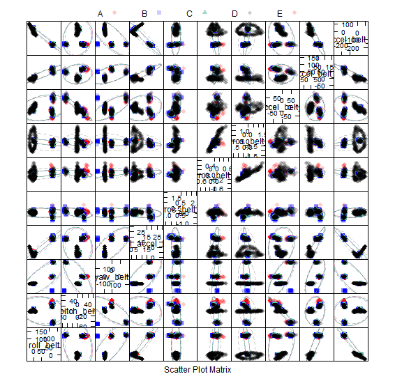
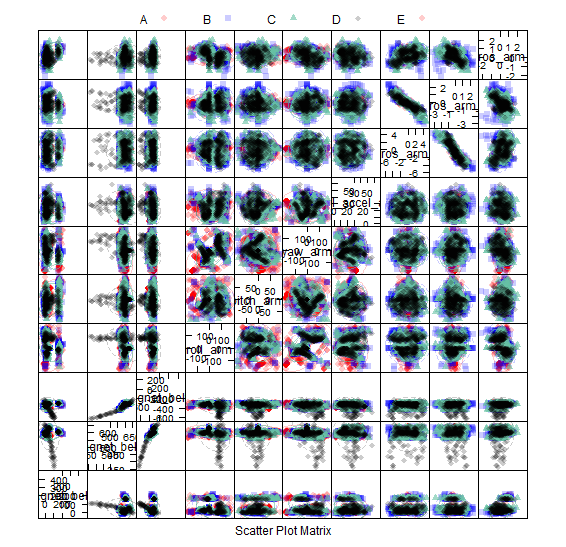
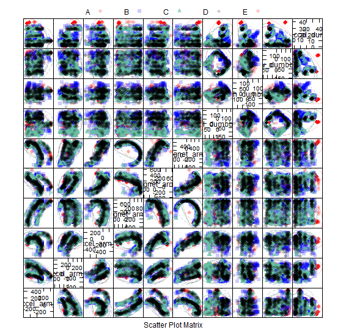
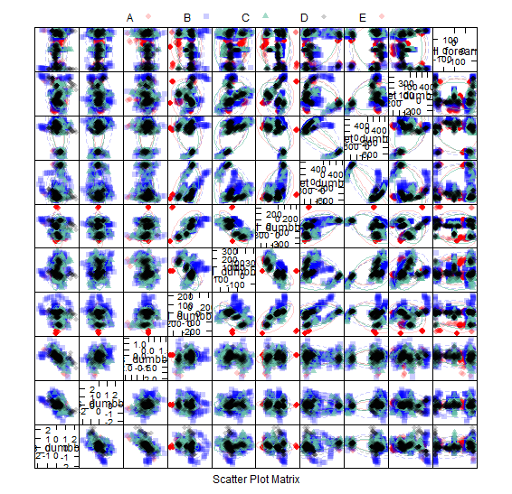
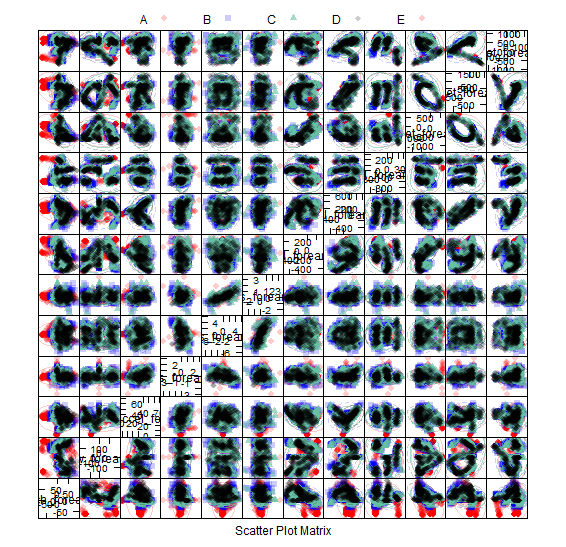

##Objectives & Constraints: 

- Build model to predict class and describe analysis
- explain why i made the choices i made
- Describe what I expect the out of sample error to be
- Estimate out of sample error with cross validation
- <2000 words

## Reading in and Cleaning the Dataset

I want to bring the data into R and do some Exploratory data analysis to understand what components will be useful to feed into the learning algorithm. After exploring the data, I removed the first 7 variables, and any variable with over 95% blanks or NA values. This reduces the dataset from 160 variables to 53.

Read in Training and Test set
```{r eval=FALSE}
trainingdirty <- read.csv('pml-training.csv')
validation <- read.csv('pml-testing.csv')
```

Cleaning the Data
```{r eval=FALSE}
#Remove junk variables
training <- trainingdirty[,-1:-7]

#Removing columns with large numbers of NAs & Blanks
training <- training[ ,colSums(is.na(training))<19000]
training <- training[ ,colSums(training=='')<19000]
```

##Splitting Data into Training & Testing Sets

I split the training data into a training and test set for cross validation purposes. I began with a small p value of 0.2, so that I could evaluate model performance without long wait times, and increased p to 0.4 once I had refined the model. I found that increase sample size increased accuracy.  

```{r eval=FALSE}
inTrain = createDataPartition(training$classe, p = 0.4)[[1]]
trainingsmall = training[ inTrain,]
testingsmall = training[ -inTrain,]
```

## Exploratory Data Analysis

To explore the relationships between the variables and understand how they relate to the 5 classes, I have plotted a Scatterplot Matrix with Ellipses. This plot shows there is only limited separation of classes across two dimensions, and that a more complicated multidimensional model is required to be able to predict class information.It also shows that there are some variables that are correlated with each other, so can potentially be removed from the model.







## Building the Model

I began building a random forest algorithm with the standard defaults. The random forest algorithm is effective with class predictions, and requires little tuning. I wanted to test model performance by measuring both accuracy, and the error rate.

In random forests, there is no need for cross-validation or a separate test set to get an unbiased estimate of the test set error. It is estimated internally, during the run with the Out-of bag error (OOB). I have decided to test the model on a test set in addition to the OOB error. 

```{r}
RandomForestModel <- train(classe~., data=trainingsmall,
                           method='rf')
RandomForestModel
RandomForestModel$finalModel
```

OOB estimate of error rate = 1.31%
Accuracy (Optimal model) = 0.979
Kappa = 0.973

# Out of Sample error rate 

I evaluated the model against the test partition of the training set. I expect the accuracy of the model would be lower in the test set, due to the algorithm attuning itself both to the signal and the noise (overfitting). The performance of the model increased on the test set, which was unexpected! I assess the out of sample error by looking at accuracy, the positive predictive value, the negative predictive value and the concordance (kappa). The Confusion matrix shows that all of these values are above 0.98, which shows a very high performing model.

```{r}
confusionMatrix(testingsmall$classe,predict(RandomForestModel,testingsmall))
```

I wanted to refine this model by removing the variables that are highly correlated, as this improves performance of random forest models. I created a correlation matrix, and removed 1 of the variables of variables that were correlated above 0.7, 0.8 and 0.9 cutoffs, and assesed how it affected the performance of my model. I found a cutoff of 0.8 yielded the best accuracy performance. This improved the performance of my model from an accuracy of 0.9901 to an accuracy of 0.9915. 

```{r}
#De-correlation to improve accuracy
corMatrix <- cor(trainingsmall[,-53])
highCorr <- findCorrelation(corMatrix, cutoff = 0.8, verbose=FALSE)

RandomForestModel2 <- train(classe~., data=trainingsmall[,-highCorr],
                           method='rf', importance=TRUE,
                           verbose=TRUE)
                           
confusionMatrix(testingsmall$classe,predict(RandomForestModel2,testingsmall))
```


